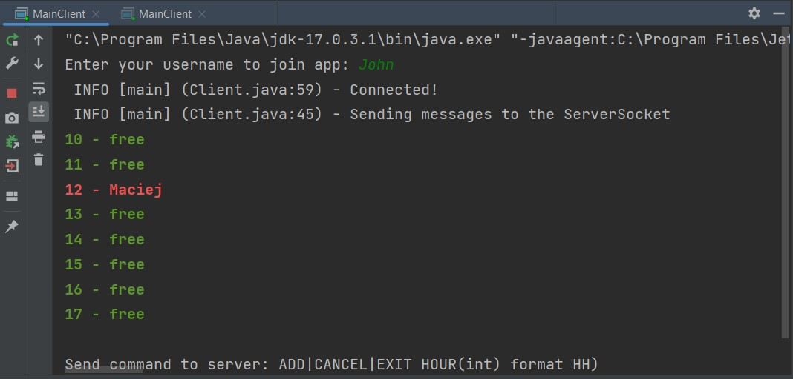
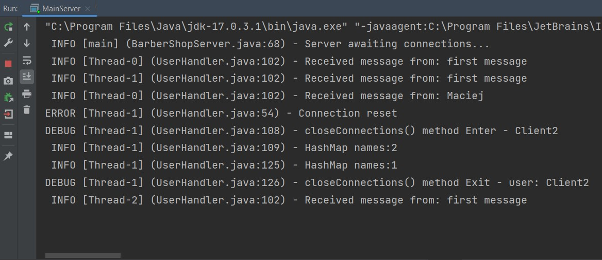

# java-socket-barbershop

- App was build in IntelliJ IDEA. Run pom.xml from main catalog to open project.
- App to let customers make an appointment for a haircut.
- Program cares about CPU usage and network bandwidth usage. There is no active waiting.

## Client
  - customers (client app) send booking request to server the dates of visits they would like to make. 
  - clients can see the current occupancy status of the hairdresser (the client's screen displays a change of view after each update of the hairdresser's schedule). 
  - client can ADD and REMOVE appointment
  - example client command "ADD 12"

Client preview:

## Server
  - cares about uniq client nicknames (can't be duplicated)
  - send messages about booked hours to all clients, causing the client's view to be refreshed
  - handle each client socket in new socket
  - sync client threads access 

Server preview:
